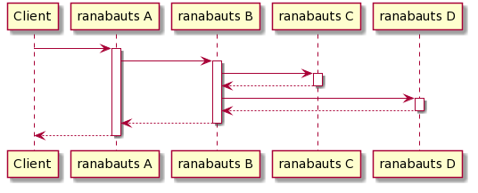

# ranabauts
This is web application for learning deployment of microservice.

## Features

* ranabauts can process request that call other ranabauts.
* ranabauts can call multiple other ranabauts.
* ranabauts can process nested requests. 

For example, ranabauts can process request like this.



1. Client calls ranabauts A with commands.
2. ranabauts A calls ranabauts B with commands.
3. ranabauts B calls ranabauts C.
4. ranabauts B calls ranabauts D.
5. ranabauts A response to Client.

This sample is described at following Command endpoint sample section.

## Endpoints

### Command

Command can executes multiple commands such as HTTP request.

#### Parameters

| param | name | type | description |
| --- | --- | --- | --- |
| body | root | Command | command |

##### type:Command

| name | type | description |
| --- | --- | --- |
| type | string | HTTP |
| uri | string | URI |
| commands | array<Command> | Command list for next hop |

#### Sample

In this sample, there are 4 ranabauts.
These applications has following endpoint.
 
* a: http://a.example.com
* b: http://b.example.com
* c: http://c.example.com
* d: http://d.example.com

When client calls request with sample body, applications make following requests. 

1. a call b
2. b call c
3. b call d

##### Sample request
```
POST /commands
```

##### Body
```json
{
    "type": "HTTP",
    "uri": "http://a.example.com",
    "commands": [
        {
            "type": "HTTP",
            "uri": "http://b.example.com",
            "commands": [
                {
                    "type": "HTTP",
                    "uri": "http://c.example.com"
                },
                {
                    "type": "HTTP",
                    "uri": "http://d.example.com"
                }
            ]
        }
    ]
}
```

### HealthCheck

Health check by Spring actuator.
This endpoint ignore basic auth if enabled.

##### Sample request

```
Get /actuator/health
```

## Configuration
### Environment variables

| name | description |
| ---- | ----------- |
| SPRING_SECURITY_USER_NAME | Basic authentication username. If this value is null, no authentication needs to access.|
| SPRING_SECURITY_USER_PASSWORD | Basic authentication password. |
